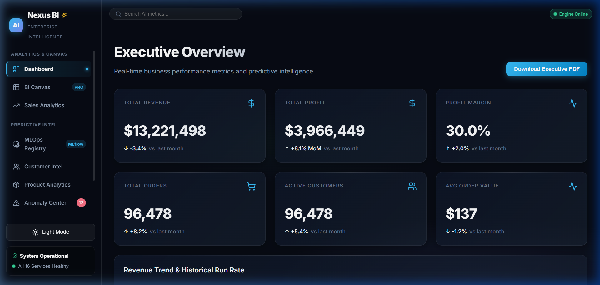
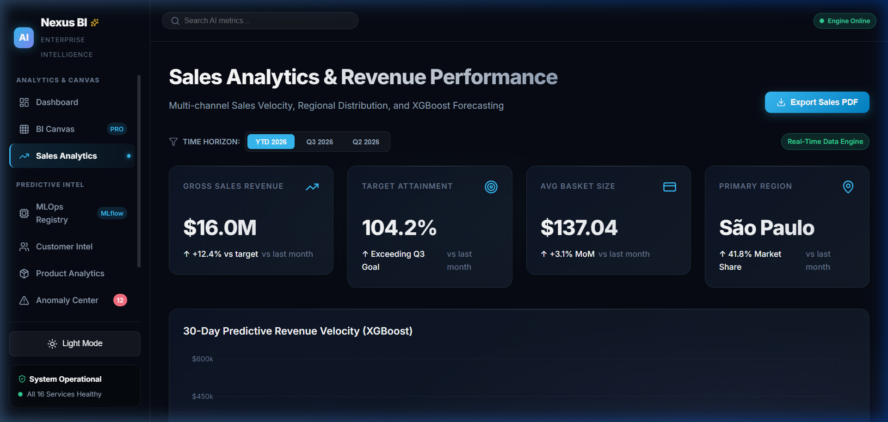
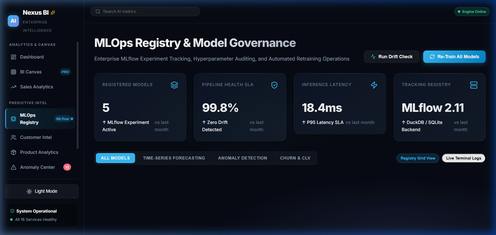

# 🌌 Enterprise AI Business Intelligence Platform

[](https://ai-business-intelligence-platform-u.vercel.app/)
[](https://nexus-bi-backend-4q5s.onrender.com/health)
[](https://nextjs.org/)
[](https://fastapi.tiangolo.com/)
[](https://duckdb.org/)
[](LICENSE)

A production-grade, full-stack **Enterprise AI & Business Intelligence Platform** built with **Next.js 16**, **FastAPI**, **DuckDB**, **XGBoost**, **Isolation Forest**, and **MLflow**. Features real-time analytical dashboards, predictive sales forecasting, automated anomaly detection, SHAP explainability, and LLM-powered natural language SQL querying.

---

## 🌐 Live Cloud Deployments

- **🌐 Web Application Dashboard**: [https://ai-business-intelligence-platform-u.vercel.app/](https://ai-business-intelligence-platform-u.vercel.app/)
- **⚙️ Live Backend REST API**: [https://nexus-bi-backend-4q5s.onrender.com/health](https://nexus-bi-backend-4q5s.onrender.com/health)

---

## 📸 Platform Screenshots

### 📊 1. Executive Overview Dashboard
> *Real-time KPI cards ($13.2M Revenue, 96.4k Orders), revenue trend run-rate, and executive PDF report generator.*



---

### 📈 2. Sales Analytics & Revenue Forecasting
> *Multi-channel sales velocity, regional sales distribution, payment method breakdowns, and 30-day XGBoost revenue forecasting.*



---

### ⚙️ 3. MLOps Control Center & Tracking Registry
> *MLflow 2.11 model tracking registry, pipeline health SLA matrices (99.8%), evaluation metrics, hyperparameter drawers, and live terminal console.*



---

## 🚀 Key Features

- **⚡ High-Performance Analytical Engine**: In-memory OLAP query execution using **DuckDB** over the 100,000+ record Brazilian E-Commerce dataset.
- **🤖 Predictive Machine Learning**:
  - **Revenue Forecasting**: XGBoost & Prophet time-series models for 30-day run-rate predictions.
  - **Anomaly & Fraud Detection**: Isolation Forest multi-feature outlier detection across revenue, inventory, traffic, and order metrics.
  - **Customer Churn & CLV**: SHAP-explained customer retention scoring and lifetime value prediction.
  - **Product Recommendations**: Collaborative filtering for cross-sell and up-sell opportunities.
- **🌌 Option 1 Design System**: Glassmorphic dark theme built with curated HSL design tokens (`#38BDF8` Electric Cyan, `#818CF8` Neon Violet, `#34D399` Mint Emerald).
- **📱 100% Mobile Responsive**: Touch-optimized slide-in navigation drawer, fluid typography, and responsive grid breakpoints.
- **📜 Executive PDF Report Generator**: ReportLab & FPDF automated PDF generation with embedded analytics charts.

---

## 🏗️ Architecture & Tech Stack

```
                                  +------------------------------+
                                  |   Vercel Edge CDN (Next.js)  |
                                  |  - Responsive Glassmorphism  |
                                  |  - Recharts & Framer Motion  |
                                  +--------------+---------------+
                                                 |
                                                 v REST / JSON
                                  +--------------+---------------+
                                  |  Render.com (FastAPI Server) |
                                  |  - Uvicorn ASGI Runner       |
                                  |  - Prometheus Monitoring     |
                                  +--------------+---------------+
                                                 |
                     +---------------------------+---------------------------+
                     |                                                       |
                     v                                                       v
      +--------------+---------------+                       +---------------+---------------+
      |    DuckDB OLAP Engine        |                       |   MLflow Tracking Registry    |
      |  - 100k+ E-Commerce Data     |                       |  - XGBoost & Prophet Models   |
      |  - Aggregated Analytics      |                       |  - Isolation Forest Outliers  |
      +------------------------------+                       +-------------------------------+
```

| Component | Technology Used |
|---|---|
| **Frontend Framework** | Next.js 16 (App Router), React 19, TypeScript |
| **Styling & Aesthetics** | Dark Glassmorphic Design System (Option 1 Palette), Vanilla CSS, Framer Motion |
| **Data Visualization** | Recharts (Area, Line, Bar, Scatter, Radar) |
| **Backend API** | FastAPI, Uvicorn, Python 3.11, Pydantic v2 |
| **Analytical Database** | DuckDB (OLAP Columnar Database) |
| **ML Engine** | XGBoost, Prophet, Scikit-Learn, PyTorch, SHAP |
| **MLOps & Governance** | MLflow 2.11 Tracking Registry & Model Store |
| **Monitoring** | Prometheus FastAPI Instrumentator |

---

## 🛠️ Local Development & Quick Start

### 1. Clone & Setup Environment

```bash
git clone https://github.com/psahani3486/Ai-Business-Intelligence-Platform.git
cd Ai-Business-Intelligence-Platform
```

Create a `.env` file in the root directory:

```env
DATABASE_PATH=data/warehouse.duckdb
GROQ_API_KEY=your_groq_api_key_here
MLFLOW_TRACKING_URI=./mlruns
```

### 2. Start Backend (FastAPI)

```bash
pip install -r requirements.txt
python -m uvicorn backend.api.main:app --host 127.0.0.1 --port 8000 --reload
```

### 3. Start Frontend (Next.js)

```bash
cd frontend
npm install
npm run dev
```

Open **`http://localhost:3000`** in your browser to access the dashboard.

---

## 🐳 Docker Deployment

To launch the full stack locally via Docker Compose:

```bash
docker-compose up -d --build
```

- **Dashboard**: `http://localhost:3000`
- **FastAPI Docs**: `http://localhost:8000/docs`
- **MLflow UI**: `http://localhost:5000`

---

## 📄 License

Distributed under the MIT License. See `LICENSE` for details.
